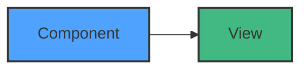
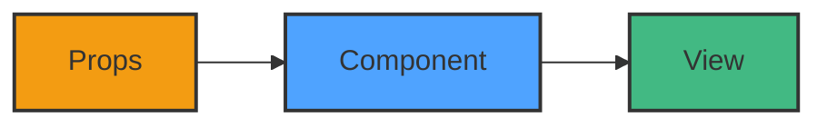
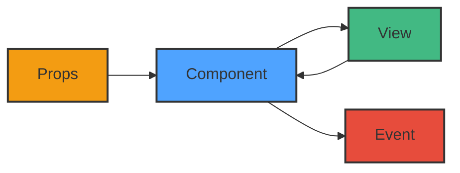

No matter the JavaScript framework (Vanilla, Vue.js, Angular, React, ...) you use, they share some common vision of what a component should be. So whenever the framework you use, you can test your components the same way!

From this idea, I tried myself to create a testing library that would allow me to test components the same way no matter the framework I use. This is how component-test-utils was born.

But it was a failure because in the same time, react-testing-library was created and became popular very quickly and then was renamed to Testing Library to embrace agnistic framework testing as I think it should be.

However, I still want to share with you the main ideas behind testing composent because I think they are relevant and can help you to test your components better.

## Level 1 : What to test ?

A component is a custom HTML element that produces a **View** (aka. a piece of others Component and HTML elements).
So we can represent a component like this:



When represented like this, it is obvious that the main thing to test in a component is the **View** it produces.
In other words :

- A **function** return a **value**, when testing a **function**, we assert **the returned value** is the expected one.
- A **component** produce a **view**, when testing a **component**, we assert **the produced view** is the expected one.

So it's as easy as that, right ? Just render the component and check the produced HTML is the expected one.

We can naively represent this idea like this:

```javascript
it('should render hello world title', () => {
  const component = render(Component)

  expect(component.html()).toBe('<h1>Hello World</h1>')
})
```

And if you think about it, this is exactly what snapshot testing is for!

```javascript
it('should render hello world title', () => {
  const component = render(Component)
  expect(component.html()).toMatchSnapshot()
})
```

But nooo, it's a bit more complex than that...
Because view can vary a LOT during development!

So we need to consider only a portion of the view, or a specific behavior of the component to not be flooded of error while developing.

That's why library for testing components (like Testing Library) provide a whole bunch of helper to navigate in the HTML.

A better way to assert the view would be:

```javascript
it('should render hello world title', () => {
  const component = render(Component)
  expect(component.html().getElementByRole('heading')).toBe('Hello World')
})
```

## Level 2 : Input based testing

To continue the analogy with functions, we can vary the returned value by giving various parameters, how about components?

Components cand receive **props** (or attributes, or input, the name really depend on the framework), so we can vary the produced view by changing the props values.

Let's represent this:



And illustrate this with an example:

```javascript
it('should render "hello world" title', () => {
  const component = render(Component)
  expect(component.html().getElementByRole('heading')).toBe('Hello World')
})

it('should render "hello florent" title', () => {
  const component = render(Component, { props: { name: 'florent' } })
  expect(component.html().getElementByRole('heading')).toBe('Hello florent')
})
```

At this point, the test you write is as simple as any other back-end test.
Complexity arise when components start to have their own behavior and it's the next levels we will explore!

## Level 3 : Users can interact with the view!

HTML is not static, users can interact with it. Buttons can be clicked, inputs can be filled, etc.
So how we can test this kind of behavior ?

When a user interact with the view, there is 2 possibilities:

- The view is updated directly (we will see this in the next level)
- An event is emitted to inform the parent component of the interaction.

Let's represent this interaction:



So we have to use a spy to catch the event emitted by the component when the user interact with it.

An example with vitest:

```javascript
it('should emit onClick Event', () => {
  const spy = vi.fn()
  const component = render(Component, { events: { onLike: spy } })

  component.getElementByRole('button').dispatchEvent(new MouseEvent('click'))

  expect(spy).toHaveBeenCalled()
})
```

When you look this example, you can be tempted to think is very close to End to End testing with Playwrite or Cypress.
You are right, the code YOU write is very similar but here it's involve way less technologies, you don't need a browser, only node.js and depend on your testing framework a mock to the DOM API like jsdom or happy-dom.

## Level 4 : Component can store data?!

Statefull component

Unfortunately, components can sometimes be a bit more complex. For example when they have their own state. Considering the previous example, imagine the like button has different styles depending on whether or not the user have liked the related content.

Because component-test-utils considers each component as a black box, you cannot modify or access their internal state.

Instead, you have to trigger an internal event from the view itself !

Statefull component

For example, if you want to test the different styles of your “like” button :

describe('like button style', () => {
it('should set button to notLiked by default', () => {
const component = shallow(Component, {props: {nbLikes: 1}});

    component.querySelector('button').dispatchEvent('click');

    expect(component.html().querySelector('button').props.class).not.toContain(
      'liked'
    );

});

it('should set button to liked when clicking on the button', () => {
const component = shallow(Component, {props: {nbLikes: 1}});

    component.querySelector('button').dispatchEvent('click');

    expect(component.html().querySelector('button').props.class).toContain(
      'liked'
    );

});
});

Component, event output

Important: React being the only rendering library currently supported, these features are not implemented yet as they're not needed in react

Because components sometimes need to talk with parent components, frameworks usually use an event based system to setup an upward communication channel between components and their parents.

Component that emit event

To ensure your component emit the right event, you can attach spies to components and test if they have been called.

describe('like button - onLike event', () => {
it('should emit onClick Event', () => {
const spy = createSpy();
// const spy = jest.fn(); using jest
const component = shallow(Component, {events: {onLike}});

    component.querySelector('button').dispatchEvent('click');

    expect(spy).toHaveBeenCalled();

});
});

## Level 5 : External tools (services, mixins, ...)

Component with externals

Important: React being the only rendering library currently supported, these features are not implemented yet as they're not needed in react

For example, Angular component can inject services in the constructor of the components.

To inject services, mixins, etc, an external key to the shallow configuration object is available. The content of externals object is specific to the framework you are testing. It gives you the opportunity to provide some non-standardized data to a component.

This part is the only framework specific thing you will have to learn for testing with component-test-utils !

Component with externals

An example :

describe('user component', () => {
it('should display the user retrieves from the service', () => {
const component = shallow(Component, {
externals: {
userService: {
getUser: () => Promise.resolve({name: 'component-test-utils'})
}
}
});

    expect(component).toContain('component-test-utils');

});
});

## Mocking strategies

Mocking strategies

Components doesn't only generate HTML element, they can have sub-components in their view. For this kind of "parent" component, here is the main question developers should ask themselves: "should I mock this child component ?".

In this case, Component-test-utils provides two ways to create a component in a test environment:

    White list: Every sub-component is mocked, you can give a list a component that won't be mocked and give their mock.
    Black list: No sub-component is mocked, you can specify which component should be mocked.

Given these components:

const postListRender = ({posts}) => `

  <div>
    ${posts.map(postData => `<Post data={postData}/>`)}
    <OtherComponent />
  </div>
`;

const postRender = ({data}) => `

  <article>
    <h1>${data.title}</h1>
    <p>${data.content}</p>
  </article>
`;

White list (default)

const cmp = shallow(postListRender, {
props: {
posts: [
{title: 'post1', content: 'content1'},
{title: 'post2', content: 'content2'},
]
},
mocks: {
OtherComponent: `<div>OtherComponent</div>`
}
});

cmp.html() === `

  <div>
    <Post />
    <Post />
    <div>OtherComponent</div>
  </div>
`;

Black list

const cmp = shallow(postListRender, {
props: {
posts: [
{title: 'post1', content: 'content1'},
{title: 'post2', content: 'content2'},
]
},
mocks: {
OtherComponent: false
},
blackList: true
});

cmp.html() === `

  <div>
    <article>
      <h1>post1</h1>
      <p>content1</p>
    </article>
    <article>
      <h1>post2</h1>
      <p>content2</p>
    </article>
    <OtherComponent />
  </div>
`;
