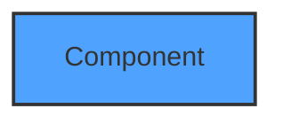
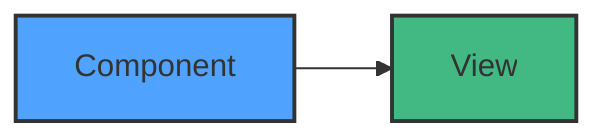
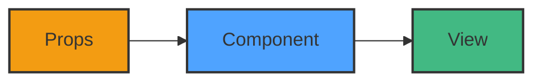
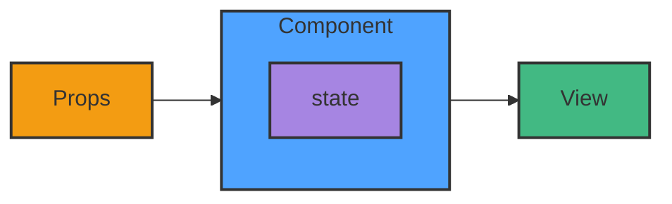
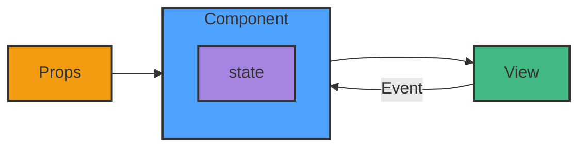

# Formation React


**Florent Berthelot**

- Consultant - ESN
- Consultant Formateur - ESN
- Freelance (WeFacto, Human Coder)

Web Software Craftsman

[https://berthelot.io](https://berthelot.io)


## Programme

```
- Jour 1
    - Rappels JavaScript
    - Découverte de React
- Jour 2
    - COMPOSANTS
- Jour 3
    - Routing
    - Les effets de bords, ...
```


## Travaux pratiques

Je ne donne les corrections qu'à la fin de la formation.
Les solutions sont toujours multiples.

Posez-moi des questions.


##  Bataille de Pokémon !

[http://pokemon.lux.frachet.berthelot.io/](http://pokemon.lux.frachet.berthelot.io/)

<iframe  src="http://pokemon.lux.frachet.berthelot.io/" frameborder="0"></iframe>


## Informations pratique

- Matin : 9h - 12h30
- Après-midi : 14h - 17h30

Demandez des pauses.

Nous nous notons mutuellement !

N'oubliez pas d'émarger sur le site de Human Coder.


### Rappels

Quel est la nouveauté qui vous a plus le plu dans la dernière version de JavaScript ?


## TC39

[Lien vers la formation JavaScript](./javascript#/2)


## Les ESmodules

[Lien vers les modules JavaScript](https://slides.com/florentberthelot/les-modules-javascript/)


### TP 1

Créez une page Web, pour l'instant Vide.
Cette page charge un fichier JS et aussi ceci :

```html
<!-- Votre page HTML -->

<script src="https://unpkg.com/react@18/umd/react.development.js" crossorigin></script>
<script src="https://unpkg.com/react-dom@18/umd/react-dom.development.js" crossorigin></script>

<!-- Votre page HTML -->
```


### Pourquoi faire un Framework JS ?


### Qui est derrière ?

Meta

...

mais depuis Octobre 2025, React Foundation


### Popularité


### Pourquoi c'est populaire ?

- Stable
- Stable
- JSX
- Assez performant
- Simple !
- Progressive Framework ou Lib


### Le positionnement de React

React
<br/><br/>
Vue.js
<br/><br/>
Angular


### "Hello World"

```html
<div id="my-react-application"></div>
```

```javascript
const domContainer = document.querySelector('#my-react-application');

const root = ReactDOM.createRoot(domContainer);
root.render(React.createElement('h1', {}, 'Hello world'));
```


## TP2

Démarrer React pour afficher votre nom sur la page Web


## JSX

```html
<div id="my-react-application"></div>
```

```javascript
const domContainer = document.querySelector('#my-react-application');

const root = ReactDOM.createRoot(domContainer);
root.render(React.createElement('h1', {}, 'Hello world'));
```


## Plus

```javascript
const domContainer = document.querySelector('#my-react-application');

const root = ReactDOM.createRoot(domContainer);
root.render(
  React.createElement('main', {},
  [
    React.createElement('header', {},
       React.createElement('h1', {}, 'Hello world')
    ),
    React.createElement('section', {}, 'lorem ipsum')
  ])
, domContainer);
```


## Encore plus ?

```javascript
const domContainer = document.querySelector('#my-react-application');

const root = ReactDOM.createRoot(domContainer);
root.render(
  React.createElement('main', {},
  [
    React.createElement('header', {},
       React.createElement('h1', {}, 'Hello world')
    ),
    /** ... **/
    React.createElement('section', {},
       React.createElement('article', {}, [
        React.createElement('p', {}, 'lorem ipsum'),
        React.createElement('p', {}, 'lorem ipsum')
       ]),
       React.createElement('article', {}, [
        React.createElement('p', {}, 'lorem ipsum'),
        React.createElement('p', {}, 'lorem ipsum')
       ])
    )
    /** ... **/
  ])
, domContainer);
```


## JSX à la rescousse

```javascript
const domContainer = document.querySelector('#my-react-application');

const root = ReactDOM.createRoot(domContainer);
root.render(
  <main>
    <header>
      <h1>Hello world</h1>
    </header>
    {/** ... **/}
    <section>
      <article>
        <p>lorem ipsum</p>
        <p>lorem ipsum</p>
      </article>
      <article>
        <p>lorem ipsum</p>
        <p>lorem ipsum</p>
      </article>
    </section>
    {/** ... **/}
  </main>
, domContainer);
```


## Outillage Node.js

[https://slides.com/florentberthelot/outillage-node-js](https://slides.com/florentberthelot/outillage-node-js)


## TP3

Ajoutez et configurez ces outils :

```markdown
- NVM
- NPM
- GIT
- JEST
- Babel / SWC
- Vite / Webpack
- ESLINT
- PRETTIER
- Installer React
- ... ?
```


## Flemme ?

<iframe src="https://create-react-app.dev" width="100%" height="400px" style="background: white;" frameborder="0"></iframe>


## De nouvelles alternatives officielles

<iframe src="https://react.dev/learn/build-a-react-app-from-scratch" width="100%" height="400px" style="background: white;" frameborder="0"></iframe>


## TP3

Initialisez le projet avec Create React App

Observez le code et les outils qui ont été généré.

Changez le contenu de la Page pour afficher votre nom.


## TP3 - V2

Initialisez le projet avec Vite

```bash
npm create vite@latest pokemonArena -- --template react
```


## Template


### Qu'est ce qu'un composant ?

```html
<LikeButton></LikeButton>
```

ou

```html
<LikeButton />
```


### Qu'est ce qu'un composant ?

```html
<!-- Composant Parent -->
<LikeButton></LikeButton>
```

<br/>




### Qu'est ce qu'un composant ?

```html
<!-- Composant Parent -->
<LikeButton></LikeButton>
```

```jsx
// like.component.jsx
const LikeButton = () => {
  return <button>O j'aime</button>;
}
```

<br/>




## Améliorons notre code !

```jsx
// like.component.jsx
const LikeButton = () => {
  const nbOfLike = 0;

  return <button>{nbOfLike} j'aime</button>;
}
```

<br/>


## Améliorons notre code !

```jsx
// like.component.jsx
const LikeButton = () => {
  const nbOfLike = 0;

  return <button>{nbOfLike} j'aime{nbOfLike > 1 ? 's' : ''}</button>;
}
```

<br/>


## Et la sémantique ?

```jsx
// like.component.jsx
const LikeButton = () => {
  const nbOfLike = 0;

  return (
    <button type="button">
    	{nbOfLike} j'aime{nbOfLike > 1 ? 's' : ''}
    </button>;
  );
}
```

<br/>


## Et le style ?

```jsx
// like.component.jsx
const LikeButton = () => {
  const nbOfLike = 0;

  return (
    <button type="button" className="btn-primary">
    	{nbOfLike} j'aime{nbOfLike > 1 ? 's' : ''}
    </button>;
  );
}
```

<br/>


## Mieux ?

```jsx
// like.component.jsx
const LikeButton = () => {
  const nbOfLike = 0;
  const liked = true;

  return (
    <button type="button" className="btn-primary" style={{color: liked ? 'red' : 'grey'}}>
    	{nbOfLike} j'aime{nbOfLike > 1 ? 's' : ''}
    </button>;
  );
}
```

<br/>


## Encore mieux ?

```jsx
// like.component.jsx
const LikeButton = () => {
  const nbOfLike = 0;
  const liked = true;

  return (
    <button type="button" className={`btn-primary ${liked ? 'btn-liked' : ''}`}>
    	{nbOfLike} j'aime{nbOfLike > 1 ? 's' : ''}
    </button>;
  );
}
```

<br/>


## TP4

Créez la structure HTML de votre arène de Pokémon.
Une arène se compose de deux Pokémons qui s'affrontent.
<br/><br/>
Pour l'instant, l'écran est figé.
Il n'y a qu'un seul composant Arène.


## Tester

[https://slides.com/florentberthelot/javascript-craftmanship/](https://slides.com/florentberthelot/javascript-craftmanship/)


## Testing library

<iframe src="https://testing-library.com/docs/react-testing-library/intro/" width="100%" height="400px" style="background: white;" frameborder="0"></iframe>


## Live coding

[Lien perso](https://stackblitz.com/edit/vitejs-vite-ss8jjkow?file=src%2FLikeButton%2FLikeButton.jsx)


## Le resultat du live coding

```jsx
import { render, screen } from "@testing-library/react"
import { LikeButton } from "./likeButton"

describe('LikeButton', () => {
    it("should display 0 like", () => {
        render(<LikeButton />)

        expect(screen.getByText('0 like')).toBeVisible()
    })
})
```


## TP5

Réparez vos tests.


## TP5 - V2

Ajoutez Vitest a votre projet et écrivez un test pour s'assurer que les 2 pokémons ont bien toutes leurs vies.


## Les Props


### Comment passer des données ?

```html
<!-- Composant Parent -->
<LikeButton></LikeButton>
```

```jsx
// like.component.jsx
const LikeButton = () => {
  const nbOfLike = 0;
  const liked = true;

  return (
    <button type="button" className={`btn-primary ${liked ? 'btn-liked' : ''}`}>
    	{nbOfLike} j'aime{nbOfLike > 1 ? 's' : ''}
    </button>;
  );
}
```

<br/>


### Comment passer des données ?

```html
<!-- Composant Parent -->
<LikeButton liked={true} nbOfLike={1} />
```

```jsx
// like.component.jsx
const LikeButton = (props) => {
  const nbOfLike = props.nbOfLike;
  const liked = props.liked;

  return (
    <button type="button" className={`btn-primary ${liked ? 'btn-liked' : ''}`}>
    	{nbOfLike} j'aime{nbOfLike > 1 ? 's' : ''}
    </button>;
  );
}
```

<br/>




### Mieux ?

```html
<!-- Composant Parent -->
<LikeButton liked nbOfLike={1} />
```

```jsx
// like.component.jsx
const LikeButton = (props) => {
  const nbOfLike = props.nbOfLike;
  const liked = props.liked;

  return (
    <button type="button" className={`btn-primary ${liked ? 'btn-liked' : ''}`}>
    	{nbOfLike} j'aime{nbOfLike > 1 ? 's' : ''}
    </button>;
  );
}
```

<br/>


## Destructuring ?!

```html
<!-- Composant Parent -->
<LikeButton liked nbOfLike={1} />
```

```jsx
// like.component.jsx
const LikeButton = ({
  nbOfLike,
  liked
}) => {
  return (
    <button type="button" className={`btn-primary ${liked ? 'btn-liked' : ''}`}>
    	{nbOfLike} j'aime{nbOfLike > 1 ? 's' : ''}
    </button>;
  );
}
```

<br/>


## TP6

Séparez en plusieurs composants l'arène.
Passez des données entre les composants.


## State

Et effets de bords


## State

```html
<!-- Composant Parent -->
<LikeButton />
```

```jsx
// like.component.jsx
const LikeButton = () => {
  const nbOfLike = 0;

  return (
    <button type="button">
    	{nbOfLike} j'aime{nbOfLike > 1 ? 's' : ''}
    </button>;
  );
}
```

<br/>


## State

```jsx
// like.component.jsx
const LikeButton = () => {
  const NbLikeState = React.useState(0);

  return (
    <button type="button">
    	{NbLikeState[0]} j'aime{nbOfLike > 1 ? 's' : ''}
    </button>;
  );
}
```

<br/>




## Destructuring ?!

```jsx
// like.component.jsx
const LikeButton = () => {
  const [nbOfLike, setNbOfLike] = React.useState(0);

  return (
    <button type="button">
    	{nbOfLike} j'aime{nbOfLike > 1 ? 's' : ''}
    </button>;
  );
}
```

<br/>


## Instant bonne pratique

> Tout ce qui est dans un React.useState doit être totalement indépendant des autres useState.


## Effets de bord

Qu'est ce qu'un effet de bords ?

```jsx
const Timer = () => {
  const [ellapsedTime, setEllapsedTime] = React.useState(0);


  return <span>Il s'est passé {ellapsedTime} secondes.</span>;
}
```

<br/>


## UseEffect

```jsx
const Timer = () => {
  const [ellapsedTime, setEllapsedTime] = React.useState(0);

  React.useEffect(() => {
    setInterval(() => {
      setEllapsedTime((ellapsedTime) => ellapsedTime + 1);
    }, 1000)
  }, [])


  return <span>Il s'est passé {ellapsedTime} secondes.</span>;
}
```

<br/>


## Quel est le problème dans l'exemple précédent ?


## Fuite de mémoire !

```jsx
const Timer = () => {
  const [ellapsedTime, setEllapsedTime] = React.useState(0);

  React.useEffect(() => {
    const interval = setInterval(() => {
      setEllapsedTime((ellapsedTime) => ellapsedTime + 1);
    }, 1000)

    return () => {
      clearInterval(interval);
    }
  }, [])


  return <span>Il s'est passé {ellapsedTime} secondes.</span>;
}
```

<br/>


## TP7

Les Pokémons s'attaquent maintenant à raison d'une attaque (ou tour) par seconde.

(Pour l'instant seul les points de vies changent)


## Les évènements


### Comment écouter le click ?

```jsx
// like.component.jsx
const LikeButton = () => {
  const [nbOfLike, setNbOfLike] = React.useState(0);

  return (
    <button type="button">
    	{nbOfLike} j'aime{nbOfLike > 1 ? 's' : ''}
    </button>;
  );
}
```

<br/>


## onClick ! (camelCase)

```jsx
// like.component.jsx
const LikeButton = () => {
  const [nbOfLike, setNbOfLike] = React.useState(0);

  return (
    <button type="button" onClick={() => setNbOfLike(nbOfLike++)}>
    	{nbOfLike} j'aime{nbOfLike > 1 ? 's' : ''}
    </button>;
  );
}
```

<br/>




## Ses propres évènements ?

```jsx
const Tweet = () => {
  const [nbOfLikes, setNbOfLikes] = useState(0);
  return <LikeButton nbOfLikes={nbOfLikes} onLike={() => setNbOfLikes(nbOfLikes++)} />
}
```

```jsx
// like.component.jsx
const LikeButton = ({onLike, nbOfLike}) => {

  return (
    <button type="button" onClick={() => onLike()}>
    	{nbOfLike} j'aime{nbOfLike > 1 ? 's' : ''}
    </button>;
  );
}
```

<br/>

```mermaid
graph LR
  style Component fill:#4fa3ff,stroke:#333,stroke-width:2px
  style View fill:#42b983,stroke:#333,stroke-width:2px
  style Props fill:#f39c12,stroke:#333,stroke-width:2px
style state fill:#a685e2,stroke:#333,stroke-width:2px
  subgraph Component
    state
  end
  Props --> Component
  Component ---> View
  View --Event--> Component
```


## Comment tester des évènements ?

L'empathie !


## Comment tester des évènements ?

```jsx
import { fireEvent, render, screen } from '@testing-library/react';

it('should display 1 like when cliking on the button', () => {
  render(<LikeButton />);

  screen.fireEvent(screen.getByRole('button'))

  expect(screen.getByText('1 like')).toBeVisible()
})
```


## Alternative plus complète

```jsx
import { render, screen } from '@testing-library/react';
import userEvent from '@testing-library/user-event'

it('should display 1 like when cliking on the button', async () => {
  render(<LikeButton />);

  await userEvent.click(screen.getByRole('button'));

  screen.getByText('1 like');
})
```


## TP8

Ajoutez un boutton Play/Pause.

Par défaut, le combat est en pause.


## Props #2

Validation et valeurs par défault


### Valeurs par défaut

```jsx
const LikeButton = ({
  onLike = () => {},
  nbOfLike = 0
}) => {
  return (
    <button type="button" onClick={() => onLike()}>
    	{nbOfLike} j'aime{nbOfLike > 1 ? 's' : ''}
    </button>;
  );
}
```


### Valeurs par défaut

```jsx
const LikeButton = ({onLike, nbOfLike}) => {
  return (
    <button type="button" onClick={() => onLike()}>
    	{nbOfLike} j'aime{nbOfLike > 1 ? 's' : ''}
    </button>;
  );
}

LikeButton.defaultProps = {
	onLike: () => {},
	nbOfLike: 0
}
```


### Validation des Props

```jsx
import PropTypes from 'prop-types';

const LikeButton = ({onLike, nbOfLike}) => {
  return (
    <button type="button" onClick={() => onLike()}>
    	{nbOfLike} j'aime{nbOfLike > 1 ? 's' : ''}
    </button>;
  );
}

LikeButton.defaultProps = {
	nbOfLike: 0
}

LikeButton.proptypes = {
  onLike: PropTypes.func.isRequired,
  nbOfLike: PropTypes.number
}
```


## Trucs et astuces

Boucles, affichage conditionnel, ...


## Les fragments

```jsx
const Tweets = () => {
    const datas = [/* ... */]
    return (
      <React.Fragment>
        <Tweet data={datas[0]}/>
        <Tweet data={datas[1]}/>
      </React.Fragment>
    )
}
```


## Les fragments

```jsx
const Tweets = () => {
    const datas = [/* ... */]
    return (
      <>
        <Tweet data={datas[0]}/>
        <Tweet data={datas[1]}/>
      </>
    )
}
```


## Boucles

```jsx
const Tweets = () => {
  const items = [
    {id: 1, price: 10_00},
    {id: 2, price: 150_00}
  ]
  return (
    <ul>
      {items.map((item) => {
        return <li>{item.price}</li>;
      })}
    </ul>
  )
}
```


## Boucles

```jsx
const Tweets = () => {
  const items = [
    {id: 1, price: 10_00},
    {id: 2, price: 150_00}
  ]
  return (
    <ul>
      {items.map((item) => {
        return <li key={item.id}>{item.price}</li>;
      })}
    </ul>
  )
}
```
Important !
Fait l'objet d'une règle ESLint


## Boucles, autre exemple

```jsx
const Tweets = () => {
  const tweets = [
    {id: 1, message: 'coucou' /* ...*/ },
    {id: 2, message: 'un thread !' /* ...*/ }
  ]
  return (
    <section>
      {tweets.map(tweet => {
        return <Tweet key={tweet.id} tweet={tweet}/>;
      })}
    </section>
  )
}
```


## Affichage conditionnel

```jsx
const Tweets = ({
  isUserTweet
}) => {
  return (
    <article>
      {/* ... */}
      {
        isUserTweet ?
           <EditButton /> :
           null
      }
    </article>
  )
}
```


## Affichage conditionnel

```jsx
const Tweets = ({
  isUserTweet
}) => {
  return (
    <article>
      {/* ... */}
      {isUserTweet && <EditButton />}
    </article>
  )
}
```

[Attention, possible pièges](https://kentcdodds.com/blog/use-ternaries-rather-than-and-and-in-jsx)


### Transclusion, children, ...

```jsx
const Parent = () => {
  return (
    <Modal>
    	<h2>lorem ipsum</h2>
    	<button>close</button>
    </Modal>
}

const Modal = ({children}} => {
  return (
    <div className="modal">
	  {children}
    </div>
  )
}
```


### Destructuring

```jsx
const TweetPage = () => {
	const tweets = [{
		id: 1,
		message: "destructuring ?",
		isLiked: false,
		nbOfLike: 0,
		image: "http://placeholder.com/random.jpg"
	}]

	return (
	<section>
		{tweets.map(tweet => {
		return <Tweet
			key={tweet.id}
			message={tweet.message}
			isLiked={tweet.isLiked}
			nbOfLike={tweet.nbOfLike}
			image={tweet.image}
			/>
		})}
	</section>
	)
}
```


## Destructuring

```jsx
const TweetPage = () => {
	const tweets = [{
		id: 1,
		message: "destructuring ?",
		isLiked: false,
		nbOfLike: 0,
		image: "http://placeholder.com/random.jpg"
	}]

	return (
		<section>
			{tweets.map(tweet => {
				return <Tweet key={tweet.id} {...tweet} />
			})}
		</section>
	)
}
```


## TP9

Améliorez votre code.
<br/>
Afficher les logs de la bataille sur la page.
<br/>
Maintenant le Pokemon vaincu se voit graphiquement.


## Le Legacy

Les classes components


### Classe Component

```jsx
class LikeComponent extends React.Component {
  render() {
    return (
       <button type="button">
        0 j'aime
       </button>
    );
  }
}
```


### Props dans une classe Component

```jsx
class LikeComponent extends React.Component {
  render() {
    const {nbOfLike} = this.props
    return (
       <button type="button">
        {nbOfLike} j'aime
       </button>
    );
  }
}
```


### State dans une classe Component

```jsx
class LikeComponent extends React.Component {
  state = {
    nbOfLike: 0
  }

  constructor() {
    super();
    this.handleLike = this.handleLike.bind(this);
  }

  handleLike() {
    this.setState({
      nbOfLike: this.state.nbOfLike + 1
    })
  }

  render() {
    return (
       <button type="button" onClick={this.handleLike}>
        {this.state.nbOfLike} j'aime
       </button>
    );
  }
}
```


### Gestion d'erreur

```jsx
const Tweet = () => {
  return (
    <ErrorBoundary>
      <LikeButton />
    </ErrorBoundary>
  )
}

const LikeButton = () => {
  throw new Error('Not Implemented');
}
```


### Gestion d'erreur

```jsx
class ErrorBoundary extends React.Component {
  constructor(props) {
    super(props);
    this.state = { hasError: false };
  }

  static getDerivedStateFromError(error) {
    return { hasError: true };
  }

  componentDidCatch(error, errorInfo) {
    sendErrorToSentry(error, errorInfo);
  }

  render() {
    if (this.state.hasError) {
      return <h1>Page d'erreur.</h1>;
    }

    return this.props.children;
  }
}
```


## TP10

Créer un composant ErrorBoundary qui affiche un message d'erreur à l'utilisateur et qui dans le même temps afficher l'erreur dans la console du navigateur.
<br/>
<br/>
Pour tester, modifiez un composant pour qu'il renvoi une erreur.
<br/>
Qu'observez-vous ?


## Cycle de vie d'un composant

- Mount
- Updates
    - (Errors)
- Unmount


### Classe Component

```jsx
class LikeComponent extends React.Component {
  state = {
    nbOfLike: 0
  }

  constructor() {
    super();
    this.handleLike = this.handleLike.bind(this);
  }

  handleLike() {
    this.setState({
      nbOfLike: this.state.nbOfLike + 1
    })
  }

  render() {
    return (
       <button type="button" onClick={this.handleLike}>
        {this.state.nbOfLike} j'aime
       </button>
    );
  }
}
```


### Cycle de vie - Mount

```jsx
class LikeComponent extends React.Component {
  state = {
    nbOfLike: 0
  }

  constructor() {
    super();
    this.handleLike = this.handleLike.bind(this);
  }

  handleLike() {
    this.setState({
      nbOfLike: this.state.nbOfLike + 1
    })
  }

  componentDidMount() {
    sendDataToAnalytics();
  }

  render() {
    return (
       <button type="button" onClick={this.handleLike}>
       	{this.state.nbOfLike} j'aime
       </button>
    );
  }
}
```


### Mount

- constructor
- getDerivedStateFromProps
- render
- componentDidMount


### Updates

- getDerivedStateFromProps
- shouldComponentUpdate
- getSnapshotBeforeUpdate
- render
- componentDidUpdate


### Unmount

- ComponentWillUnmount


## Les hooks

Enfin l'explication !


### Règle #1

> Toujours appeler les hooks depuis un composant React.


### Règle #2

> Toujours appeler les hooks au plus haut niveau de la fonction de rendu.
<br/>
(Pas dans une boucle, pas dans un if, etc.)


### Pourquoi les hooks ?

1. Découper le code
2. &nbsp;
2. &nbsp;


### Pourquoi les hooks ?

1. Découper le code
2. Donner du sens au code <br> (on ne parle plus technique mais métier)
2. &nbsp;


### Pourquoi les hooks ?

1. Découper le code
2. Donner du sens au code <br> (on ne parle plus technique mais métier)
2. Partager de la logique entre les composants


### UseState

```jsx
const LikeButton = () => {
  const [nbOfLike, setNbOfLike] = React.useState(0);

  return (
    <button type="button">
    	{nbOfLike} j'aime{nbOfLike > 1 ? 's' : ''}
    </button>;
  );
}
```


### UseMemo

```jsx
const Einstein = () => {
  const result = React.useMemo(() => whatIsTheLifeGoal(), []);

  return result;
}
```


### UseMemo

```jsx
const Einstein = ({
  humanName
}) => {
  const result = React.useMemo(
    () => whatIsTheLifeGoal(humanName),
    [humanName]
  );

  return result;
}
```


### UseMemo

```jsx
const Einstein = ({
  humanName
}) => {
  const result = React.useMemo(() => whatIsTheLifeGoal(humanName));

  return result;
}
```


### useEffect

```jsx
const Tweet = ({id}) => {
  useEffect(() => {
   	console.log('A new render occured');
  })

  return result;
}
```


### useEffect

```jsx
const Tweet = ({id}) => {
  useEffect(() => {
   	console.log('Id changed', id);
  }, [id])

  return result;
}
```


### useEffect

```jsx
const Tweet = ({id}) => {
  useEffect(() => {
   	console.log('Initial id', id);
  }, [])

  return result;
}
```


### UseCallback

```jsx
const TweetEdit = ({id}) => {
  const handleSubmit = useCallback(() => {
    fetch(`addTweet?userId=${id}`)
  }, [id])

  return <TweetForm onSubmit={handleSubmit} />;
}
```


### Un hook custom ?

```jsx
const TweetEdit = ({id}) => {
  const [inputValue, setInputValue] = useState(initialValue);

  const onInput = (e) => {
    setInputValue(e.target.value);
  }

  return <input type="text" onInput={onInput} value={inputValue} />;
}
```


### Un hook custom !

```jsx
const useInput = (initialValue) => {
  const [inputValue, setInputValue] = useState(initialValue);

  const onInput = (e) => {
    setInputValue(e.target.value);
  }

  return [inputValue, onInput];
}

const TweetEdit = ({id}) => {
  const [value, onInput] = useInput()

  return <input type="text" onInput={onInput} value={value} />;
}
```


### Les autres hooks

<iframe src="https://react.dev/reference/react/hooks" width="100%" height="400px" style="background: white;" frameborder="0"></iframe>


## TP11

Déplacez la logique de bataille dans un hook custom.


## Les appels HTTP


## Les appels HTTP

Il n'y a pas de manière officiel pour récupérer des données


###  Fetch API

```jsx
const Tweet = () => {
  const [fetchState, setFetchState] = useState({
    error: null,
    data: null,
  	isLoading: true
  });
  
  useEffect(() => {
    fetch('/people.json')
    	.then(res => res.json())
    	.then(data => {
      		setFetchState({
              data,
              isLoading: false
            })      
		});
    	})
        .catch(err => {
        	setFetchState({
            	error: err,
              	isLoading: false
            })      
		});
  }, [])
  
  
  if(fetchState.isLoading) {
    return 'loading...':
  }

  if(fetchState.error) {
    return <>Refresh page</>
  }

  return <>{fetchState.data}</>
}
```

### Fetch API Généralisation

```jsx
const useQuery = (url) => {
  const [fetchState, setFetchState] = useState({
    error: null,
    data: null,
    isLoading: true
  });
  
  useEffect(() => {
    fetch(url)
      .then(res => {
        if(!res.ok) {
          throw new Error('bouu')
        }
        return res
      })
    	.then(res => res.json())
    	.then(data => {
          setFetchState({
            data,
            isLoading: false
          })
    	})
        .catch(err => {
          setFetchState({
            error: err,
            isLoading: false
          })
    	});
  }, [])
  
  return fetchState;
}

const Tweet = () => {
  const {
    data,
    isLoading,
    error
  } = useQuery('people.json')
  
  
  if(isLoading) {
    return 'loading...':
  }
 
  if(error) {
    return <>Refresh page</>
  }
 
  return <>{data}</>
}
```


### Tanstack Query

```jsx
import { QueryClient, QueryClientProvider, useQuery } from '@tanstack/react-query'
 
const queryClient = new QueryClient()
const App = () =>  {
   return (
     <QueryClientProvider client={queryClient}>
       <Tweet />
     </QueryClientProvider>
   )
 }
 
const Tweet = () => {
   const { isLoading, error, data } = useQuery({
	queryKey: ['peoples'],
	queryFn: () => fetch('/peoples.json').then(res => res.json())
   });
 
   if (isLoading) {
     return 'Loading...';
   }
 
   if (error) {
     return 'Please refresh the page.';
   }
 
   return <>{data}</>
 }
```


### Tanstack Query

<iframe src="https://tanstack.com/query/latest/" width="100%" height="400px" style="background: white;" frameborder="0"></iframe>


### Tanstack Query

```bash
npm i @tanstack/react-query
```

```jsx
import { QueryClient, QueryClientProvider } from '@tanstack/react-query'

const queryClient = new QueryClient()
const App = () =>  {
   return (
     <QueryClientProvider client={queryClient}>
       <YourAppComponents />
     </QueryClientProvider>
   )
 }
```


### Tanstack Query

```jsx
import { useQuery } from '@tanstack/react-query'

const Tweet = () => {
   const { isLoading, error, data } = useQuery({
      queryKey: ['peoples'],
      queryFn: () => fetch('/peoples.json').then(res => res.json())
   });

   if (isLoading) {
     return 'Loading...';
   }

   if (error) {
     return 'Please refresh the page.';
   }

   return <>{data}</>
 }
```


## TP12

Faites appel à une API Pokémon pour récupérer les stats des Pokémons