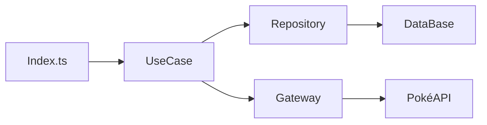

# Formation TypeScript Avancée


**Florent Berthelot**

- Consultant - ESN
- Consultant Formateur - ESN
- Freelance (WeFacto, Human Coder)
 
Web Software Craftsman

https://berthelot.io


## Programme

- Jour 1
    - Rappels TypeScript & JavaScript
    - Programmation Orientée Objet
    - Générique
- Jour 2
    - Safe By Pattern
    - Types en détail (utils et conditionnels)
    - TypeScript & API
    - TypeScript & Frameworks Web
    - Une librairie écrite en TypeScript


## Travaux pratiques

Je ne donne les corrections qu'à la fin de la formation.
Les solutions sont toujours multiples.

Posez-moi des questions.


## Travaux pratiques

Le sujet : Pokédex


## Informations pratique

- Matin : 9h - 12h30
- Après-midi : 14h - 17h30

Demandez des pauses.

Nous nous notons mutuellement !

N'oubliez pas d'émarger sur le site de Human Coder.


## TypeScript

Qu'est-ce que TypeScript ?


## Qu'est-ce que c'est ?


Langage créé par Anders Hejlsberg en 2012

Projet open-source maintenu par Microsoft

[Un documentaire pour plus d'informations sur l'histoire](https://www.youtube.com/watch?v=U6s2pdxebSo)


## Pourquoi TypeScript ?

- Rends le typage explicite
- Ajoute une couche de test (Compilation vs Runtime)
- Feedback rapide grâce aux IDE

*Moyen de pression par Microsoft pour ajouter des nouvelles fonctionnalités dans JavaScript*


## Qui ?

> We're now firmly in the TypeScript era. 67% of respondents stated they write more TypeScript than JavaScript code – while the single largest group consisted of people who only write TypeScript.
> - 2025 State of JS


## Concurence ?

Elm - Plus strict que TypeScript, uniquement pour le front

Flow - Facebook, pas très populaire

JsDoc - Pas vraiment un langage


## La raison du succès ?

- Types explicites
- Extensible (creation de types)
- ...
- Tout programme JavaScript est un programme TypeScript


# JavaScript aujourd'hui

Quel est la fonctionalité ajouté au JavaScript cette année vous a le plus plu ?


## TC39

[Lien vers la formation JavaScript](./javascript#/2)


## Les ESmodules

[Lien vers les modules JavaScript](https://slides.com/florentberthelot/les-modules-javascript/)


# Rappels TypeScript - Compile


## CLI

```bash
tsc src/index.ts
```

Qu'est ce que ça fait ?


## TSconfig.json

```json
{
    "compilerOptions": {
        "module": "commonjs",
        "target": "es5",
        "noImplicitAny": false,
        "sourceMap": false,
        "outDir": "dist"
    },
    "include": [
        "src/**/*"
    ]
}
```
```bash
tsc
```


## TP 1

Créez un projet TypeScript

```bash
mkdir formation-ts-avancee
cd formation-ts-avancee
mkdir src/
touch src/index.ts
npm init
npm i typescript --save-dev
npx tsc --init
```


## TP 1

Puis mettez en place vos scripts

```json
{
  "name": "package.json",
  "...": "...",
  "scripts": {
    "build": "tsc",
    "start": "node build/index.js"
  }
}
```

Challenge, votre projet doit être compilé dans un dossier nommé `build`.


# Rappels TypeScript - Langue


## Types prémitifs
```typescript
const pi: number = 1;
const name: string = 'toto';
const canYouReadThis: boolean = true;
const useless: undefined;
let covid: null = null;
```


## Types par références

```typescript
const schools: string[] = ['ESGI', 'EFREI', 'EPITA'];
const schools2: Array<string> = ['ESGI', 'EFREI', 'EPITA'];
 
schools.push('EPITECH');	// OK
schools.push(42);		    // KO
 
const user1: {name: string, roles: string[]} = {
  name: 'Florent Berthelot',
  roles: []
};

user1.roles.push('Admin'); 	// OK
user1.roles.push(42); 	    // KO
```


## Any et Unknown

```typescript
let notSure: any = 4;
notSure = "maybe a string instead";
 
console.log(notSure.toto); // Erreur d'execution
 
notSure = {toto: 42};
console.log(notSure.toto); // OK
 
 
let notSureSafe: unknown = notSure;
console.log(notSureSafe.toto); // Erreur de compilation
```


## Fonctions

```typescript
function namedFunction(arg1: string, arg2?: number, arg3: string = 'hello'): string {
  return `${arg3}, ${arg1} - ${arg2}`;
}

const concat: (arg1: string, arg2: number) => string = (arg1, arg2) => arg1 + arg2;
```


## Fonctions

```typescript
function printNumber(x: number): void {
    console.log(x);
}
 
function error(message: string): never {
    throw new Error(message);
}
 
 
function infiniteLoop(): never {
    while (true) {
    }
}
```


## Pourquoi on Type ?

```typescript
let ImAVar: number = 42;
ImAVar = 'toto';
```

Qu'est ce qu'il se passe dans cette exemple ?


## Runtime Vs Compile time

Qui est impacté par le bug ?


## Pyramide des test

<div class="pyramid">
  <div class="pyramid__section">E2E</div>
  <div class="pyramid__section">Intégration</div>
  <div class="pyramid__section">Unitaire</div>
  <div class="pyramid__section">Statique</div>
</div>
<style>
.pyramid {
  display: flex;
  flex-direction: column;
  -webkit-clip-path: polygon(50% 0, 100% 100%, 0 100%);
  clip-path: polygon(50% 0, 100% 100%, 0 100%);
}
.pyramid__section {
  flex: 1 1 100%;
  background-color: white;
  color: black;
  line-height: 5rem;
  margin-bottom: 2px;
}
</style>


## TP 2

Créez une constante pokemons qui contient les statisiques de 4 Pokémons.

Aussi, créez une fonction qui prends un Pokémon en entrée,
ne retourne rien et affiche en console un jolie message avec les stats du pokemon.


## Les classes en JavaScript


## ES5

[Slide classes en JS](http://localhost:4040/slides/javascript#/3/21)

Voir ES5, ES6 et ES2022.


## En 2022

```JavaScript
class TwitterOrX {
  name;
  #owner;

  constructor() {
    this.name = 'Twitter';
  }

  #buyTwitter() {
    this.#owner = 'Elon Musk'
    this.name = 'X'
    return 'done';
  }
}
```


## Typescript

```Typescript
class TwitterOrX {
  name: string;
  #owner: string;

  constructor() {
    this.name = 'Twitter';
  }

  #buyTwitter(): string {
    this.#owner = 'Elon Musk'
    this.name = 'X'
    return 'done';
  }
}
```


## Alternative Typescript

```JavaScript
class TwitterOrX {
  name: string; // public est optionel
  private owner: string;

  constructor() {
    this.name = 'Twitter';
  }

  private buyTwitter() {
    this.owner = 'Elon Musk'
    this.name = 'X'
    return 'done';
  }
}
```
Attention, runtime vs compile time.


## Différence entre JS et TS

```Typescript
// Ne fonctionne pas en TS
class TwitterOrX {
  constructor(name) {
    this.name = name;
  }
}

// Fonctionne en TS
class TwitterOrX {
  name: string;

  constructor(name: string) {
    this.name = name;
  }
}
```


## LE RACCOURCI

```Typescript
class TwitterOrX {
  constructor(public name: string) {}
}
```


## La clean architecture


## TP 3

Nous allons créer un pokedex qui va nous permettre d'ajouter des pokemons à notre collection (en mémoire).

On valide notre code via notre index.ts.


## TP 3

Niveau architecture, nous avons besoin, à minima :
 - repository :
    - une méthode pour ajouter un pokemon
    - une méthode pour récupérer tous les pokemons
 - gateway avec :
    - une méthode pour récupérer tous les pokemons existants
    - on simule une API avec notre tableau de pokemons du TP 2


## TP 3

2 usecases qui :
  - Ajoute un pokemon dans notre pokedex :
    Attention, on ne peut pas avoir 2 fois le même pokemon, notre pokemon gagne un niveau si on le possède déjà.
  - Liste l'ensemble des pokemons possédés et leurs niveaux


## La clean architecture




## Interfaces - Objet

```typescript
interface Duck{
  color: string
  fly(height: number): void
  quack: (message: string) => void
}
 
const duck: Duck = {
  color: 'yellow',
  fly: height => {},
  quack: message => {}
}
```


## Interfaces - Fonction

```typescript
interface SayHello {
  (message: string): string;
}
 
let sayHello: SayHello;
 
sayHello = function(source: string): string {
  return source.toLowerCase();
}
```


## Interfaces - Classe

```typescript
interface Person {
  sayHello(message: string): void;
}
 
class Adult implements Person {
  sayHello(message: string): void {
    console.log(`Hello ${message}`);
  }
}
```


## Pourquoi les interfaces ?

C'est un contrat, on peut donc avoir plusieurs implémentations.

Des exemples de cas d'utilisation d'interfaces ?


## Les tests !

[https://slides.com/florentberthelot/javascript-craftmanship/](https://slides.com/florentberthelot/javascript-craftmanship/)


## TP4

Ajoutez Jest ou Vitest à votre projet.
Testez votre usecase en mockant la gateway mais pas le repository.


## Les types

```typscript	
type X = {
    a: number
    b: string
};

type A = X | null;
```


## Alias VS Interface

```typescript
interface Animal {
  name: string
}
 
interface Bear extends Animal {
  honey: boolean
}
```

```typescript
type Animal = {
  name: string
}
 
type Bear = Animal & { 
  honey: boolean 
}
```


## Alias VS Interface

```typescript
interface Point { x: number; }
interface Point { y: number; }
 
const point: Point = { x: 1, y: 2 };
```

```typescript
type Point = { x: number; }
type Point = { y: number; } // KO
```


## Alias VS Interface

```typescript
type Point2 = {
  x: number;
  y: number;
};
 
class SomePoint2 implements Point2 {
  x = 1;
  y = 2;
}
 
type PartialPoint = { x: number; } | { y: number; };
 
// FIXME: can not implement a union type
class SomePartialPoint implements PartialPoint {
  x = 1;
  y = 2;
}
```


## Alias VS Interface

```typescript
// primitive
type Name = string;
 
interface Name {
  name: string;
}
```


### Théorie des types

Qu'est ce qui est le plus précis ?

```pseudocode
x: any
y: number
z: int
w: 1 | 2 | 3 | 4 | 5 | 6
```


### Safe By pattern

Plus on est précis, plus on a la sécurité de ne pas se tromper.

A un certain niveau de typing, un programme qui compile est un programme qui fonctionne.


## Safe By pattern

```typescript
type Dice = 1 | 2 | 3 | 4 | 5 | 6;

const diceResult: Dice = 6;
```


### Safe by pattern

```typescript
type PokemonTypes = "fire" | "ice" | "lightning";
 
type PokemonId = `${PokemonTypes}-${string}`
 
 
const pikaId: PokemonId = 'lightning-pickachu';
```


### Safe By pattern

Tuple
```typescript
const pokemonStats: (string | number)[] = ["Pikachu", 42, "Electric"];
 
const pokemonStats2: [string, number, string] = ["Pikachu", 42, "Electric"];
```


### Safe by pattern

```typescript
const pickachu = {
  name: 'pika'
}
 
type PokemonName = typeof pickachu['name'];
``` 


### Safe by pattern

Le mode non-strict de TypeScript

```typescript
type number = number | null | undefined;
type string = string | null | undefined;
/* ... */
```


## TP 5

Contraintes suplémentaire. Lorsque l'on ajoute un pokemon pour la 1ère fois, on lui donne un nom.
Ce nom contient forcément le type de pokemon.

Exemple : "pik-elec".


## Typescript est intelligent


### Inférence de type

```typescript
const theAnswer = 42; // Type number
 
function identity(name = 'EFREI') { // name est de type string
  return name; // Type string
}
```


### Type Guards

```typescript
let stringOrStringArray: string|string[];
/**...**/
 
if (typeof stringOrStringArray === 'string') {
  console.log(stringOrStringArray.toLowerCase()); //OK
}
 
if (stringOrStringArray instanceof String) {
  console.log(stringOrStringArray.toLowerCase()); //OK
}
 
console.log(stringOrStringArray.toLowerCase()); //KO
 
 
let point: {x: string} | {y: string};
/**...**/
if('x' in point) {
  console.log(point.x);
} else {
  console.log(point.y);
}
```


### Type Guards

```typescript
function isString(x: any): boolean {
  return x instanceof String;
}
if (isString(stringOrStringArray)) {
  console.log(stringOrStringArray.toLowerCase()); //OK
}
 
/****/
 
function isString(x: any): x is string {
  return x instanceof String;
}
if (isString(stringOrStringArray)) {
  console.log(stringOrStringArray.toLowerCase()); //OK
}
```


## Readonly

```typescript
interface Rx {
  readonly x: number;
}
let rx: Rx = { x: 1 };
rx.x = 12; // error
```


## as const

```typescript
let a = [1, 2, 3] as const;
let b: readonly number[] = [1, 2, 3];

a.push(4); // KO
b.push(4); // KO
```


## as const

```typescript
const truth = 'I am the best'; // string

const truth2 = 'I am the best' as const; // 'I am the best'
```
On rend TypeScript plus intelligent !


## as const

```typescript
// Fonctionne de manière profonde
const aComplexeExemple = {
  theAnswer,
  theRealAnswer,
  test: 'coucou',
  glou: {
    ton: [true, 42, 'tuple']
  }
} as const
 
/*
{
  theAnswer: number,
  theRealAnswer: 42,
  test: 'coucou',
  glou: {
     ton: [true, 42, 'tuple']
  }
}
 
En readonly !
*/
```


## mais...

Typescript est intelligent, mais nous permet aussi de l'être moins...


## As

```typescript
const theAnswer = 42 as string; // Error
 
const theAnswer2 = 42 as unknown; // unknown !
 
const theAnswer3 = 42 as const as number; // Number
 
const theAnswer4 = 42 as unknown as 43; // 43
 
type Dish = {
  alcool: boolean
}
 
const blanquette = {alcool: true, yummy: true} as Dish
```


## Satisfies

```typescript
type posX = {
  x: number
}
type posY = {
  y: number,
}
type PartialPosition = posX | posY


const asExample = {x: 1} as PartialPosition
// asExemple: PartialPosition
 
const satisfieExample = {x: 1} satisfies PartialPosition
// satisfieExample: {x: number}
```
Très utile pour déclancher l'autocomplétion de l'IDE.


## TP 6

Lorsque l'on ajoute un pokemon de type "psy" à notre Pokédex, il confère un bonus de 2 niveaux à tous les autres pokemon de notre pokedex.
Créez une fonction `isPsyPokemon`.


## Aparté, les enums

```typescript
const enum Music { Rap, Rock, Blues };
enum AttackTypes {Fire = 2, Water = 5, thunder = 8}; 
 
const a: Music = Music.Rap;
const burn = AttackTypes.Fire;
 
const FireName: string = AttackTypes[AttackTypes.Fire]; // "Fire"
console.log(AttackTypes[5]); // KO
```


## Aparté, les enums

```typescript
type Music = 'Rap' | 'Rock' | 'Blues';
const AttackTypes = {
  Fire: 2,
  Water: 5,
  Thunder: 8
} as const;
```


## Les génériques


### Les génériques - fonctions

```typescript
function identityA<Type>(arg: Type): Type {
  return arg;
}
 
// VS 
 
function identityB(arg: unknown): unknown {
  return arg;
}
 
identityA(2).toFixed(); // OK
identityB(2).toFixed(); // KO
```


### Les génériques - classe

```typescript
class List<T, Index=number> {
  add(value: T) {
    ...
  }
  splice(value: T, index: Index){
 
  }
}
 
const numericArray = new List<number>();
 
numericArray.add(5); 
numericArray.splice(5, 2);
 
numericArray.add('hello'); // compilation err
```


### Les génériques - interfaces

```typescript
interface Pokemon {
  name: string;
}
 
function loggingIdentity<Type extends Pokemon>(arg: Type): Type {
  console.log(arg.name);
  return arg;
}
```


### Les génériques - les types

```typescript
interface Pokemon {
  name: string;
}
 
function loggingIdentity<Type extends Pokemon>(arg: Type): Type {
  console.log(arg.name);
  return arg;
}
```


## TP 7

Créez une méthode `getPokemonByType` à votre repository.
Le type de retour est un pokemon du type demandé.


## Les types utilitaires


### Avant propos

```typescript
type Pokemon = {
  owner?: string;
};
```

### Avant propos

```typescript
class PokemonRepository {
  // Pas initialisé mais pas d'erreur
  id!: string;
}

ORM.extendRepository(PokemonRepository); // Generate the id on save
```


### Partial

```typescript
interface Pokemon {
  name: string;
  type: string;
  level: number;
}

const partialPokemon: Partial<Pokemon> = {
  name: "Pikachu",
};
```
Permet de rendre tous les champs d'un type optionnels.


### Required

```typescript
interface Pokemon {
  name?: string;
  type?: string;
  level?: number;
}

const requiredPokemon: Required<Pokemon> = {
  name: "Pikachu",
  type: "Electric",
  level: 42,
};
```
Permet de rendre tous les champs d'un type obligatoires.


### Readonly

```typescript
interface Pokemon {
  name: string;
  type: string;
}

const readonlyPokemon: Readonly<Pokemon> = {
  name: "Pikachu",
  type: "Electric",
};

readonlyPokemon.name = "Raichu"; // Erreur
```
Empêche la modification des propriétés d'un objet.


### Pick

```typescript
interface Pokemon {
  name: string;
  type: string;
  level: number;
}

const pickedPokemon: Pick<Pokemon, "name" | "type"> = {
  name: "Pikachu",
  type: "Electric",
};
```
Permet de sélectionner un sous-ensemble de propriétés d'un type.


### Omit

```typescript
interface Pokemon {
  name: string;
  type: string;
  level: number;
}

const omittedPokemon: Omit<Pokemon, "level"> = {
  name: "Pikachu",
  type: "Electric",
};
```
Permet d'exclure certaines propriétés d'un type.


### Exclude

```typescript
type PokemonTypes = "fire" | "water" | "electric" | "grass";

type NonGrassTypes = Exclude<PokemonTypes, "grass">;
// Résultat : "fire" | "water" | "electric"
```
Exclut des types spécifiques d'une union.


### Extract

```typescript
type PokemonTypes = "fire" | "water" | "electric" | "grass";

type OnlyGrassType = Extract<PokemonTypes, "grass" | "electric">;
// Résultat : "grass" | "electric"
```
Extrait des types spécifiques d'une union.


### NonNullable

```typescript
type NullablePokemon = string | null | undefined;

type NonNullablePokemon = NonNullable<NullablePokemon>;
// Résultat : string
```
Supprime `null` et `undefined` d'un type.


### ReturnType

```typescript
function getPokemon(): { name: string; type: string } {
  return { name: "Pikachu", type: "Electric" };
}

type PokemonReturnType = ReturnType<typeof getPokemon>;
// Résultat : { name: string; type: string }
```
Récupère le type de retour d'une fonction.


### Parameters

```typescript
function addPokemon(name: string, type: string): void {}

type AddPokemonParams = Parameters<typeof addPokemon>;
// Résultat : [string, string]
```
Récupère les types des paramètres d'une fonction.


### Record

```typescript
type PokemonTypes = "fire" | "water" | "electric";

const pokemonByType: Record<PokemonTypes, string[]> = {
  fire: ["Charmander", "Vulpix"],
  water: ["Squirtle", "Psyduck"],
  electric: ["Pikachu", "Electabuzz"],
};
```
Crée un type d'objet avec des clés spécifiques et des valeurs associées.


## Pour aller plus loin

<iframe src="https://www.typescriptlang.org/docs/handbook/utility-types.html" width="100%" style="height:60vh;"></iframe>


## TP8

Ajoutez une fonction getPokemonByType dans votre gateway.


## Encore plus loin


A la fin de ce chapite on saura ce que veut dire cette ligne de code :

```typescript
type complexType<T extends Pokemon> =
  T extends PokemonPsy ? Record<keyof typeof mewtwo, string> : Record<keyof typeof pikachu, number>;
```


### Record

```typescript
type PokemonTypes = "fire" | "water" | "electric";

const pokemonByType: Record<PokemonTypes, string[]> = {
  fire: ["Charmander", "Vulpix"],
  water: ["Squirtle", "Psyduck"],
  electric: ["Pikachu", "Electabuzz"],
};
```

### Mapped Types

```typescript
type PokemonTypes = "fire" | "water" | "electric";

const pokemonByType: {
  [PokemonTypes]: string[];
} = {
  fire: ["Charmander", "Vulpix"],
  water: ["Squirtle", "Psyduck"],
  electric: ["Pikachu", "Electabuzz"],
};
```


### Keyof

```typescript
type Pokemon = {
  name: string;
  type: string;
  level: number;
};

type PokemonKeys = keyof Pokemon; // "name" | "type" | "level"
```


### Conditional Types

```typescript
type IsString<T> = T extends string ? true : false;

type Test1 = IsString<string>; // true
type Test2 = IsString<number>; // false
```


### infer

```typescript
type ReturnType<T> = T extends (...args: any[]) => infer R ? R : never;

function getPokemon(): { name: string; type: string } {
  return { name: "Pikachu", type: "Electric" };
}

type PokemonReturnType = ReturnType<typeof getPokemon>; 
// { name: string; type: string }
```


## Interception avec une API

### Consommer une API avec TypeScript

#### Exemple de base
```typescript
async function fetchData(url: string): Promise<any> {
  const response = await fetch(url);
  return response.json();
}

const data = await fetchData("https://pokeapi.co/api/v2/pokemon");
console.log(data);
```

#### Limitation
- Le typage `any` est trop permissif.
- Risque d'erreurs à l'exécution si les données ne correspondent pas à ce qui est attendu.

---

### Validation des données avec Zod

#### Introduction à Zod
Zod est une bibliothèque de validation de schémas qui permet de :
- Définir un schéma pour les données attendues.
- Valider les données reçues d'une API.

#### Installation
```bash
npm install zod
```

---

### Exemple avec Zod

#### Définir un schéma
```typescript
import { z } from "zod";

const PokemonSchema = z.object({
  name: z.string(),
  id: z.number(),
  types: z.array(z.object({
    type: z.object({
      name: z.string(),
    }),
  })),
});
```

#### Valider les données
```typescript
async function fetchAndValidatePokemon(url: string) {
  const response = await fetch(url);
  const data = await response.json();

  const parsedData = PokemonSchema.parse(data);
  return parsedData;
}

const validatedPokemon = await fetchAndValidatePokemon("https://pokeapi.co/api/v2/pokemon/1");
console.log(validatedPokemon);
```

#### Résultat
- Si les données sont valides : elles sont retournées avec un typage fort.
- Si les données sont invalides : une erreur est levée.

---

### Gestion des erreurs

#### Exemple
```typescript
try {
  const validatedPokemon = await fetchAndValidatePokemon("https://pokeapi.co/api/v2/pokemon/1");
  console.log(validatedPokemon);
} catch (error) {
  console.error("Erreur de validation :", error);
}
```

#### Avantages
- Détection rapide des erreurs de structure.
- Amélioration de la robustesse de l'application.

---

### Utilisation avancée avec Zod

#### Validation partielle
```typescript
const PartialPokemonSchema = PokemonSchema.partial();
```

#### Validation d'un tableau
```typescript
const PokemonListSchema = z.array(PokemonSchema);
```

#### Validation avec des valeurs par défaut
```typescript
const DefaultPokemonSchema = z.object({
  name: z.string().default("Unknown"),
  id: z.number(),
});
```

---

### TP : Intégration avec une API

1. Récupérez des données depuis l'API PokéAPI.
2. Définissez un schéma Zod pour valider les données des Pokémon.
3. Implémentez une fonction TypeScript qui :
   - Fait un appel à l'API.
   - Valide les données avec Zod.
   - Affiche les données validées dans la console.

4. Bonus : Gérez les erreurs de validation et affichez un message utilisateur.

---

### Pourquoi utiliser Zod ?

- **Sécurité** : Valide les données avant de les utiliser.
- **Typage fort** : Génère automatiquement des types TypeScript.
- **Simplicité** : Syntaxe intuitive et facile à intégrer.

---

### Ressources

- [Documentation Zod](https://zod.dev)
- [PokéAPI](https://pokeapi.co)
- [TypeScript Handbook](https://www.typescriptlang.org/docs/)


## TypeScript et Vue.js

### Introduction à Vue.js avec TypeScript
- Vue.js supporte TypeScript nativement via la CLI Vue.
### Vue.js et TypeScript

Vue 3 introduit une API Composition qui facilite l'utilisation de TypeScript.

---

### Configuration de TypeScript dans un projet Vue.js
1. Créez un projet Vue avec TypeScript :
  ```bash
  vue create my-vue-app
  ```
  Sélectionnez l'option TypeScript.
2. Exemple de fichier `tsconfig.json` :
  ```json
  {
    "compilerOptions": {
     "strict": true,
     "esModuleInterop": true,
     "module": "esnext",
     "target": "esnext"
    }
  }
  ```

---

### Typage des Props
Avec Vue 3, les props peuvent être typées directement dans la fonction `defineComponent` :
```typescript
<script lang="ts">
import { defineComponent } from 'vue';

export default defineComponent({
  props: {
   message: {
    type: String,
    required: true
   }
  },
  setup(props) {
   console.log(props.message); // Typé comme string
  }
});
</script>
```

---

### Typage des Événements
Avec Vue 3, les événements peuvent être typés pour garantir la sécurité :
```typescript
<script lang="ts">
import { defineComponent } from 'vue';

export default defineComponent({
  emits: {
   update: (value: number) => typeof value === 'number'
  },
  setup(_, { emit }) {
   emit('update', 42); // Type vérifié
  }
});
</script>
```

---

### Typage des Refs
Les `ref` peuvent être typées pour garantir leur contenu :
```typescript
<script lang="ts">
import { defineComponent, ref } from 'vue';

export default defineComponent({
  setup() {
   const count = ref<number>(0);

   const increment = () => {
    count.value++;
   };

   return { count, increment };
  }
});
</script>
```

---

### TP Vue.js
1. Créez une application Vue.js avec TypeScript.
2. Implémentez un composant `TodoList` :
  - Props : `todos` (tableau de chaînes).
  - Événement : `addTodo` (ajoute un nouvel élément).
3. Bonus : Ajoutez des tests unitaires avec Vue Test Utils.
4. Bonus avancé : Ajoutez un slot nommé `todo-item` pour personnaliser l'affichage des éléments de la liste.

---

### React et TypeScript

React s'intègre parfaitement avec TypeScript pour un typage fort des composants et des hooks.

---

### Typage des Props
Les props peuvent être typées avec une interface ou un type :
```typescript
import React from 'react';

interface ButtonProps {
  label: string;
  onClick: () => void;
}

const Button: React.FC<ButtonProps> = ({ label, onClick }) => (
  <button onClick={onClick}>{label}</button>
);

export default Button;
```

---

### Typage des Hooks
Les hooks comme `useState` et `useReducer` peuvent être typés :
```typescript
import React, { useState } from 'react';

const Counter: React.FC = () => {
  const [count, setCount] = useState<number>(0);

  return (
   <div>
    <p>Count: {count}</p>
    <button onClick={() => setCount(count + 1)}>Increment</button>
   </div>
  );
};

export default Counter;
```

---

### Typage des Contexts
Les contextes peuvent être typés pour une meilleure sécurité :
```typescript
import React, { createContext, useContext } from 'react';

interface User {
  name: string;
  age: number;
}

const UserContext = createContext<User | null>(null);

const UserProvider: React.FC = ({ children }) => {
  const user = { name: 'John', age: 30 };
  return <UserContext.Provider value={user}>{children}</UserContext.Provider>;
};

const UserProfile: React.FC = () => {
  const user = useContext(UserContext);
  if (!user) return null;

  return <p>{user.name}</p>;
};

export { UserProvider, UserProfile };
```

---

### TP React
1. Créez une application React avec TypeScript.
2. Implémentez un composant `TodoList` :
  - Props : `todos` (tableau de chaînes).
  - Événement : `onAddTodo` (ajoute un nouvel élément).
3. Bonus : Ajoutez des tests unitaires avec React Testing Library.
4. Bonus avancé : Utilisez un contexte pour gérer l'état global des todos.

---

### Angular et TypeScript

Angular est conçu pour fonctionner avec TypeScript dès le départ, offrant un typage fort et des outils puissants.

---

### Typage des Services
Les services Angular peuvent être typés pour garantir la sécurité des données :
```typescript
import { Injectable } from '@angular/core';

export interface Todo {
  id: number;
  text: string;
}

@Injectable({
  providedIn: 'root'
})
export class TodoService {
  private todos: Todo[] = [];

  addTodo(todo: Todo): void {
   this.todos.push(todo);
  }

  getTodos(): Todo[] {
   return this.todos;
  }
}
```

---

### Typage des Composants
Les composants Angular utilisent des interfaces pour typer leurs entrées et sorties :
```typescript
import { Component, Input, Output, EventEmitter } from '@angular/core';

@Component({
  selector: 'app-todo-list',
  template: `
   <ul>
    <li *ngFor="let todo of todos">{{ todo }}</li>
   </ul>
   <button (click)="addTodo()">Add Todo</button>
  `
})
export class TodoListComponent {
  @Input() todos: string[] = [];
  @Output() addTodoEvent = new EventEmitter<string>();

  addTodo(): void {
   this.addTodoEvent.emit('New Todo');
  }
}
```

---

### TP Angular
1. Créez une application Angular avec TypeScript.
2. Implémentez un composant `TodoList` :
  - Input : `todos` (tableau de chaînes).
  - Output : `addTodo` (ajoute un nouvel élément).
3. Bonus : Ajoutez des tests unitaires avec Jasmine et Karma.
4. Bonus avancé : Utilisez un service pour gérer l'état global des todos.


## Une librairie écrite en TypeScript

### Intégrer une librairie JavaScript dans un projet TypeScript

#### Étape 1 : Installer la librairie
Commencez par installer la librairie JavaScript que vous souhaitez utiliser dans votre projet TypeScript :
```bash
npm install <nom-de-la-librairie>
```

#### Étape 2 : Vérifier les types
Certaines librairies JavaScript incluent déjà des définitions de types TypeScript. Vérifiez si un fichier `index.d.ts` est présent dans le package. Si c'est le cas, vous pouvez directement utiliser la librairie.

#### Étape 3 : Utiliser DefinitelyTyped
Si la librairie ne fournit pas de types, vous pouvez vérifier si des types communautaires sont disponibles via le projet [DefinitelyTyped](https://github.com/DefinitelyTyped/DefinitelyTyped). Ces types sont publiés sous le package `@types/<nom-de-la-librairie>`.

Installez les types correspondants :
```bash
npm install --save-dev @types/<nom-de-la-librairie>
```

#### Étape 4 : Ajouter des types manuellement
Si aucun type n'est disponible, vous pouvez créer vos propres définitions de types :
1. Créez un fichier `types/<nom-de-la-librairie>.d.ts`.
2. Ajoutez les définitions nécessaires :
```typescript
declare module '<nom-de-la-librairie>' {
  export function exampleFunction(arg: string): void;
}
```

#### Étape 5 : Configurer `tsconfig.json`
Assurez-vous que TypeScript inclut vos fichiers de types personnalisés. Ajoutez le chemin dans la propriété `include` de votre `tsconfig.json` :
```json
{
  "include": ["src/**/*", "types/**/*"]
}
```

---

### DefinitelyTyped : Une ressource essentielle
- **Qu'est-ce que DefinitelyTyped ?**
  DefinitelyTyped est un dépôt communautaire qui contient des définitions de types pour des milliers de librairies JavaScript.

- **Pourquoi l'utiliser ?**
  - Fournit des types pour des librairies qui n'en ont pas nativement.
  - Maintenu par la communauté, il est régulièrement mis à jour.

- **Comment contribuer ?**
  Si vous créez des types pour une librairie et souhaitez les partager, vous pouvez soumettre une PR au dépôt DefinitelyTyped.

---

### Exemple : Intégrer Lodash dans un projet TypeScript
1. Installez Lodash et ses types :
```bash
npm install lodash
npm install --save-dev @types/lodash
```

2. Utilisez Lodash dans votre code TypeScript :
```typescript
import _ from 'lodash';

const numbers = [1, 2, 3, 4];
const doubled = _.map(numbers, (n) => n * 2);
console.log(doubled);
```

3. Les types fournis par `@types/lodash` garantissent une autocomplétion et une vérification des types dans votre IDE.

---

### TP : Intégrer une librairie JavaScript
1. Choisissez une librairie JavaScript populaire (ex. `axios`, `moment`, etc.).
2. Installez la librairie et ses types via DefinitelyTyped.
3. Si les types ne sont pas disponibles, créez vos propres définitions.
4. Utilisez la librairie dans un fichier TypeScript et testez son intégration.

Bonus : Contribuez à DefinitelyTyped en ajoutant ou améliorant des types pour une librairie.


## Fin